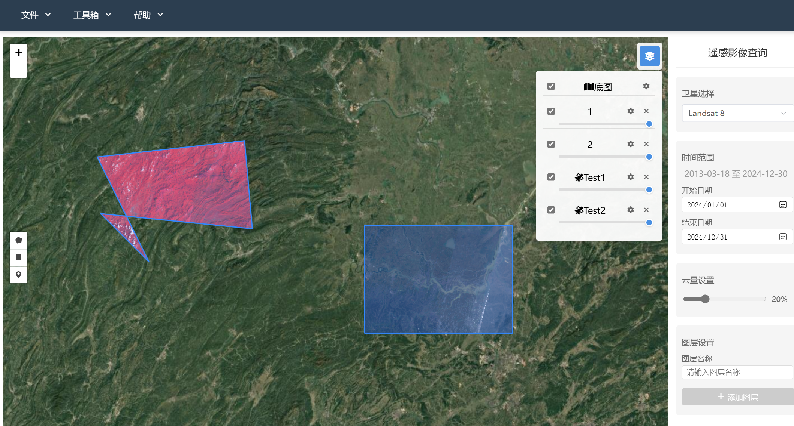

# Remote Sensing Image Processing System

A remote sensing image processing system based on Google Earth Engine platform, built with Vue 3 and Flask. The system provides rich remote sensing image processing and analysis capabilities, supporting multi-source remote sensing data processing and analysis.


## Key Features

### Data Source Support
- Most datasets from Google Earth Engine

### DEMO
### Add Layer

### Image Processing


## Tech Stack

### Frontend
- Vue 3
- Leaflet

### Backend
- Flask
- Google Earth Engine Python API
- Flask-CORS
```

## Vercel Deployment (Recommended)
- Frontend URL: https://vgee-wrjwrjwrjwrjwrjs-projects.vercel.app/
- git clone https://github.com/CousinRock/VGEE.git
- Create a system environment variable named PROJECT with value as GEE project address, e.g. ee-project
- conda create --name VGEE python=3.10 -y
- conda activate VGEE/VGEE (For Windows, add bin folder to environment variables)
- pip install -r requirements.txt
- python app.py

## Docker Deployment (Not Recommended - Currently unable to resolve service account export image issues)

## Configuration Guide

1. Copy configuration file template:
Download service account credentials JSON file from Google Cloud to backend/config directory

2. Build and start services:
```bash
# Build image
docker-compose build --no-cache
If build fails, try manually pulling image: docker pull python:3.11-slim

# Start services
docker-compose up
```

## Docker Installation
Docker Desktop Installation for Windows
- Reference: [here](https://blog.csdn.net/qq_60750453/article/details/128636298)
- Image usage reference: [here](https://blog.csdn.net/weixin_50160384/article/details/139861337)

## Google Service Account Application [here](https://console.cloud.google.com)
```bash
1. Select IAM & Admin, add permissions to main account:
- Earth Engine Apps Publisher
- Earth Engine Resource Admin
- Earth Engine Resource Viewer
- Earth Engine Resource Writer
- Service Usage Consumer

2. Select Service Accounts, create one if none exists. After creation, click the three dots on the right, select Manage Keys, create a key, and download the JSON file to backend/config directory
```

After service startup:
- Frontend access: http://localhost:8080
- Backend access: http://localhost:5000

## Important Notes

- Requires valid Google Earth Engine service account
- Ensure service account has sufficient permissions
- Large-scale data processing may require extended time

## Author
Renjie Wu
